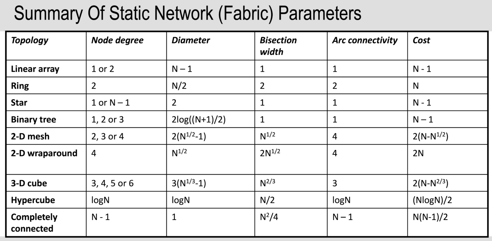

## Key nomenclature:

**Parallel v distributed**  
Parallel:
TODO: 

**Concurrency vs parallel**
Concurrent processes: processes that make progress while others are active. 
Parallel processes: processes that make progress during the same time step. 

**CPU v GPU**
CPU: a few powerful cores. Great for sequential work
GPU: many simply cores, great for parellel tasks

**CPU v ALU v core**
CPU: that's your computer, may contain 1 to many cores
Core (CPU core): that's like our chip diagram, may contain 1 to many ALUs.
ALU: basic execution unit (ie, integer/logical/address/floating point).

**Latency v efficiency v throughput v time phase**  
Time phase: the time taken for the computer architecture to do one thing (think 5 steps from computer architecture)
Throughput: the number of instructions per time phase.
Latency: the length of time for a single instruction to complete its execution cycle (ie 5 x len(time phase))
Efficiency: throughput.

**Cluster** -> connecting computers together in a network. 

## Flynn's Taxonomy

**Key:**  
**SI** = single function.  
**MD** = multiple instances of a single function with different inputs (data stream)

**SISD:** single function, single input parameters, single output, single core.  
 **Examples:** single core cpu.

**SIMD:** single function, mutliple instance of function with different inputs, multipl outputs, multple cores.  
 **Example:** matrix multiplication, GPUs on graphic processing

**MISD:** multiple functions, single input, multiple outputs, multiple cores.
**Example:** decrypting something by running multiple independent decryption algorithms

**MIMD:** multiple functions, multiple instances of function with different inputs, multiple outputs multiple cores.  
 **Example:** most things; multiple core cpu, super computer, networked computers.

## Memory Architecture:
Memory architecture is separate to Flynn's taxonomy. It's about classifying the interaction of data between processors. 
**Shared memory architecture**
Multiple processors connected by a bus or switch. Ie multi-core CPU Results in threads.    

**Distributed memory architecture**
Multiple processors connected by a network (bus switch or internet).   

**Hybrid memory architecture**
A mix of shared memory architecture and distributed memory architecture. 

## Computer Architecture
TODO: this section.  
The TLB maps between addresses and virtual addresses.
See diagram of architecture

### Process

1. Increment program counter (PC), fetch next instruction in Opcode (ie ADD)
2. Decode Opcode
3. Route operands to ALU
4. ALU operation
5. Store ALU output in register

## Parallel models
TODO: what is the context for this??
A. Shared Memory
B. Threads
C. Message Passing
D. Data Parallel
E. Hybrid
SPMD
MPMD

streams, GPUs
SMP Symmetrical Multi-Processing Machine -> all cores can run operating system and slave tasks. 

## Network and internet
TODO: do this section.  
Internet architecture, latency

## Inter process communications

**Context**  
For processors to work together, they need to communicate. Consider the delay when communicating between processors, is it worth parallelising a task between them?

Main types of IPC:
- Shared memory
- Unix signals and analogues
- Message Passing

### Shared Memory
Processes can access a single, physical, shared memory. 
- Parallel Random Access Machine (PRAM)
    - This assumes constant time access to memory which is unrealistic: it's a hypothetical model. 
    - EREW (Exclusive Read Exclusive Write) → slower
    - CREW (Concurrent Read Exclusive Write) → read the value before or after change?
    - CRCW (Concurrent Read Concurrent Write) → who writes first?
- Local Memory Machine (LMM)
    - Each processor has its own private memory. Processors can also access each other's memory, but this is slower than accessing their own. 
- Modular Memory Machine (MMM)
    - Memory is physically distributed, and connected by a network. 
    - Memory is accessed as if in one address space. 

### Unix Signals and analogues 
Ie, there are interrupts
TODO: is there anything else I need to know?

### Message Passing
TODO: I can't figure out how these pieces fit together
Keyterms: MPI, BSD sockets, SVR4 streams, Message Passing
Message passing is for communicating between processes which don't share memory. Ie sharing information accross a network -> if this is accross internet use IDP/UDP.  
**Message Passing Interface (MPI):** a higher level library and standard for message passing.

**BSD sockets**
- A specific implementation of a socket 
- (A socket is an endpoint including an IP address, a port, and an API for communication). 
- third party storage that multiple processors can access    

**SVR4 Streams**
- Information streams through; it's divided into packets and sends continuously. 

## Pipelining

**Definition:** A type of parallel processing, where each instruction is offset by one time period. Single ALU.
**Context:** With standard architecture, if we wait for the previous instruction to be loaded, the components are inactive most of the time.

### Issues

**Data hazard/ data dependency:** instruction n+1 uses output of instruction n. To resolve this, we can:

- ensure this doesn't occur at compilation,
- we can stall the cpu until instruction n is finished,
- we can forward the result.(requires extra hardward, forward it directly from the ALU unit to the ALU unit again rather than sending and retireeving from teh register).

**Conditional branch** you don't know which branch of your code you are going to follow until the conditional statement has been solved.

- We can stall the pipeline until the branch is resolved,
- or stall the first time and store the branch target in cache for the following times.
- or we can start computing both at the same time.
- speculative execution (see details below)

### Pipeline stalls

**Defintion:** for it to be a stall, nothing is coming out (finishing, being printed to memory). This means that the throughput is 0 during a stall. When something is outputted, the stall is over. So if instruction A is executing, then it requires output of instruction B, we are stalled. We wipe it, we start doing instruction B, and when instruction B finishes and is printed to memory then the stall is over.

This is why in general, it generally takes one latency period to start computing again. There are advanced mecagnisms to reduce this.
Causes: data is missed from cache, data dependency is picked up in runtime

Stalls and resolution:

- So we have data forwarding as a technique.
- If we don't ahve hte hardware then we need to know how to deal with latency period. So remember time is on our y axis. So we can only read the time period after we have stored. This requires some optimisation still.
- Then if we have no optimisation, then we have to reset it all and to instruction A first then instruction B

## Superscalar Processing

### General

**Definition** A type of parallel processing, where multiple ALUs are contained with a single core, allowing multiple instructions to be calculated in parallel. The only reason this is better than than multiple cores is because we can share the cache and stuff, so it's a bit cheaper in terms of hardware for the same performance.
**Use** Everything uses this now. It takes advantage of ILP.  
**N-way superscalar processor** N-way superscalar processor means N pipelines/ALU (Arithmetic Logic Unit)/EU (Execution Unit). Up to N times faster.  
**Instruction Level Parallelism (ILP):** is possible if instructions are not mutually dependent.

### Issues

**Data dependence:** Type of ILP. Think Data Hazard/ data dependency. Resolution: we can't forward because they are happening at the same time. Stall. They can't necessarily be avoided. Changing the compilation.
**Procedural dependence:** Type of ILP. Think conditional branch; what is the next instruction I should execute? 
- Resolution: speculative execution; you can start executing both potential branches and store the outputs in cache until we pick a path. An issue with this is that we write the two possible paths in cache, but if we fill up cache then we need to write the result of the conditional in cache, we might run into a problem (shoul dbe low occuring instance because cache should have enough storage to wait out conditional calculation). 
- Another technique is that we just calculate other unrelated things in the meantime. 
**Anti-dependency:** Type of ILP. This is when both instructions write (or one writes and one reads) to the same location, and so the order in which they write to memory matters.
**Resource Dependency:** If there are no other restrictions as described above, then we can execute more instructions than we have ALUs/EUs and so we are restricted by hardward.

## Question techniqes

- Processing unit means it's higher level we assume that things are already loaded and stuff
- We assume that there are no extra headers unless specified.

# TODO / to ask

# TO Sort:
### These are notes on Posix threads. 
Basics are pthread_create(pointer to pthread_t var, attributes/NULL, function, function's inputs) 
and pthread_join(pthread_t variable, work with return value)

int my_function();
int main()
{
pthread_t thread1;
pthread_create(&thread1, NULL, my_function, NULL);
pthread_join(thread1, NULL);
}
int my_function(){return 0;}

There are heavyweight processes and lightweight processes (threads). Threads share memory space and global variables which reduces overhead of creating new processes. 

multiplexing -> multitasking
there is a POSIX thread API
- all threads are peers apart from main thread
- #include <pthread.h>
- 

NOTE: I AM WORKING 

MIMD
Distributed memory MIMD: 
- processors connected via a network, own processor and private memory
- Advantages: scalable, less chance of reading and writing into the same memory location
- Disadvantages: Load balancing, synchronosation failures (deadlocks), entire structures might need to be copied along the network. 

Non-uniform memory access distributed memory:
Each processor has a processor and a local memory, and they are connected by a memory. 
Non-uniform memory access becuase access to local memory is high throughput low latency, but through memory belonging to another processor has a lower latency and lower bandwidth. 

Cache-corent non-uniform memory access distributed memory:
Each processor has its own cache and own memory. The caches all store the same information and need to be kept in sync

Cache only memory access
Each process only has it's own cache.

Shared memory MIMD:
- Processors connected (often by bus or switch -> physicall hardware), p processors and m memory modules which are all shared. 
- Advantages: No need to move data, don't need new compilers 
- Disadvantages: you are resonsible for synchronosation. 
- Techniques: Local caches reduce network traffic and access time (but then cache coherency problem), we can increase throughput and decrease latency. 

Scaling computers:
Latency -> delay due to transferring data across network. 
    -> introduce cache memory & solve cache coherence problem
    -> prefetching 
    -> threads and fast context switchin so that we execute another thread while we are waiting. (Context switchin within a process is lesser than accross multiple processes. )
Idling -> processor is waiting for data

Distributed memory MIMD
Level of processes, not threads. 

Interconnection networks to join cores over a distributed memory system
- Network size (number of nodes or cores)
- Number of connections per node
- network diameter (maximum length between one node and another)
- Bisection width (number of links required to be broken to split the network into two pieces) (we want this high for high reliability)
- Arc connectivity (same as bisection but for arcs (what are arcs))
- Cost (proportional to teh number of links and routers needed in the network. )

Switching techniques:
- Estimate of latency = (packet length * num nodes info travels through)/channel bandwidth = num_packets*num_nodes
If we determine the path beforehand, then keep that path reserved for this information, then it's
- Estimate of latency = two things added together tcheck clidews

Basically we need to know that the length of the packet, and the number of nodes the information travels through decreases our throughput. 

Circuit switching: latency formula here too. So we create a pathway through, then send everything through, then clear the path. 
We can route dynamically or deterministically. Dynamic routing can not use the shortest path in terms of the number of nodes, but get a shorter total latency by using routers which have less traffic. 

# Cluster:
set of distributed computers connected in a network. 

### HPC vs HTC
High performance: a single program is run as quickly as possible
High-throughput: many independent programs are run as quickly as possible. 

### CAAS: Cluster as a service
Monash has one, use a vpn. 
**SSH** is like having a terminal for a remote virtual machine. 
Don't run your code directly, request a run throguh SLURM. ie sbatch yourJob.job, then squeue to check progress. 
If you accidentally run on the head node instead of through the SLURM scheduling software, start with cnrlc, then ps to see what is running, and use kill command to manually kill them. 
